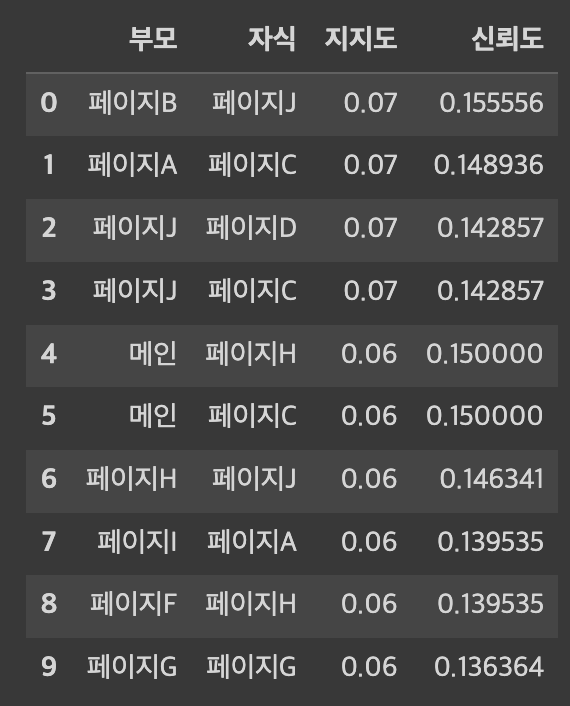
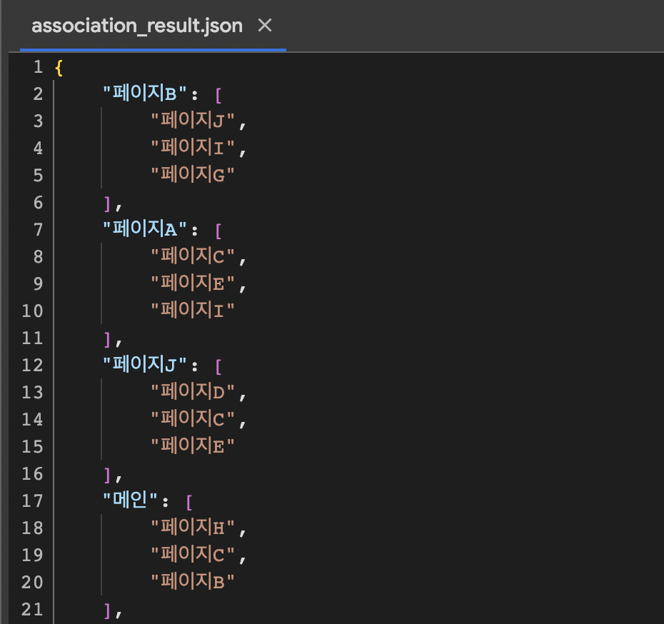

## Association Rule Analysis Using Apriori

### 1. 문제 및 목적 정의
* 문제 - Web을 방문하는 고객들을 오래 머물게 하기 위한 페이지 구성을 알아본다.
* 목적 - 체류시간이 늘어나면, Web을 방문하는 고객들에게 제품이 자연스럽게 오래 노출되며 Web의 SEO 점수 향상을 기대할 수 있다.

### 2. 시퀀스 데이터에 대한 탐색
Web을 방문하는 고객들의 페이지 방문 순서가 기록된 데이터가 있다. 데이터를 통해 빈도가 높은 방문 순서를 파악하고, 이를 적용한다면 고객들의 체류 시간 증가를 기대할 수 있다.

발생한 모든 경우에 대해 탐색하려면, 경우의 수가 너무 많기 때문에 효율적 탐색이 필요하다. 그래서 문제 해결을 위해 지지도(Support), 신뢰도(Confidence)에 대한 Apriori 원리를 적용한다. 지지도와 신뢰도에 대한 정의는 하단의 그림과 같다.

#### 2.1 지지도, 신뢰도에 대한 Apriori 원리
* 지지도에 대한 Apriori 원리는 "어떤 아이템 집합이 빈발하면, 아이템의 부분 집합도 빈발한다." 이다. 그래서 어떤 아이템 집합이 빈발하지 않으면, 해당 집합의 모집단 자체를 탐색하지 않는다. 이를 활용하여 탐색 범위를 줄인다. 하단의 그림을 보면, AB가 빈발하지 않을 경우에 AB를 포함하는 모든 집합을 탐색하지 않는다.

* 신뢰도에 대한 Apriori 원리는 동일한 아이템 집합에서 생성되는 연관 규칙을 비교하고, 최소 신뢰도 이하인 부분 집단은 탐색하지 않는다. 이를 활용하여 탐색 범위를 줄인다. 예를 들어 하단의 123 -> 4가 최소 신뢰도 보다 작다면, 하단의 연결된 모든 부분을 탐색하지 않는다.

### 3 문제 해결 프로세스
* 지지도에 대한 Apriori 원리를 활용하여 최대 빈발 아이템 집합을 찾는다.
* 신뢰도에 대한 Apriori 원리를 활용하여 최대 빈발 아이템 집합으로부터 최소 신뢰도 이하의 아이템 집합을 탐색하는데 활용한다.

### 4. 해결 방안
하단의 그림은 전체 고객의 방문 순서 데이터를 분석해 얻은 지지도와 신뢰도가 높은 상위 10개의 시퀀스 데이터이다.

해결 방안은 다음과 같다.
* 결과를 참고하여 개별 페이지마다 지지도와 신뢰도가 높은 상위 3개를 선별한다. 그리고 상위 3개를 부모 집합의 페이지 내에서 컨텐츠내 링크로 연결한다.
* 개별 페이지마다 사이드바를 생성해서 이들을 링크로 연결한다.

이를 통해 다음의 효과를 기대할 수 있다.
* 고객들이 자주 방문하는 페이지를 자연스럽게 연결할 수 있다.
* Internal Back Link 생성으로 인해 개별 Page의 SEO를 높일 수 있다.

다음은 시퀀스 데이터 탐색 결과인 json 파일이다. json 파일에 담긴 페이지를 고려해서 페이지의 구성을 변경한다.

데이터 분석을 통해 제시한 해결 방안을 통해서 앞서 문제로 설정했던 고객들의 체류 시간을 높이는 페이지 구성을 제시했다.
